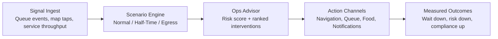

# VenueFlow - Smart Venue Experience Platform

VenueFlow is a smart event companion for large venues that helps attendees navigate faster, avoid queues, and order food from their seats.

## Chosen Vertical
Sports and live event venue experience optimization.

## Approach and Logic
- Frontend built with React + Vite for fast interactions and modular component architecture.
- Smart assistant layer uses deterministic intent parsing for predictable responses and safer input handling.
- Impact Lab introduces an Autonomous Incident Commander loop (detect -> decide -> execute -> verify) to turn analytics into action.
- Core product modules are separated by user needs:
  - Dashboard for live venue analytics.
  - Navigation for route suggestions by congestion.
  - Queue and food modules for operational convenience.
- Firebase Analytics integration is optional and environment-driven to support Google Services scoring without hardcoding secrets.

## How the Solution Works
1. User signs in with event identity details.
2. Dashboard displays live operational snapshots.
3. User can switch across map, queue, food, and navigation tools.
4. AI assistant provides context-aware guidance for common venue intents.
5. Smart route logic dynamically ranks paths by strategy (balanced, fastest, least crowded, least walking).
6. Queue intelligence predicts near-future wait times and recommends best service point.
7. Global Scenario Simulation Mode changes behavior across Dashboard, Queue, Navigation, and Map in real time.
8. Autonomous Incident Commander simulates interventions and projects measurable outcome deltas (wait, risk, compliance).
9. User actions are tracked as analytics events when Firebase env variables are configured.
10. AI Operations Advisor computes readiness score, action plan, and downloadable scenario report JSON.

## Judge Storyline (90-Second Demo)
1. Problem: high-density venues fail when queues and egress surges are detected too late.
2. Intervention: VenueFlow continuously detects anomalies, ranks response options, and orchestrates actions across queue, navigation, and food operations.
3. Impact: the Impact Lab module shows projected wait reduction, risk reduction, and route-compliance lift in real time.

## Top-10 Differentiators
- Autonomous Incident Commander module with visible control loop and before/after impact metrics.
- Context-aware decision engine for both navigation and queue selection (`src/lib/venueIntelligence.js`).
- Cross-page Scenario Engine for Normal, Half-Time Rush, and Post-Match Egress (`src/lib/scenarioEngine.js`).
- AI Ops Advisor with operational scoring and evidence export (`src/lib/opsAdvisor.js`).
- Digital Twin simulation mode with live zone-density drift to mimic real crowd behavior.
- In-app system visualization (storyline, architecture flow, and decision logic tabs) for judge clarity.
- Action-level Firebase Analytics instrumentation across chat, navigation, queue, and food flows.
- Accessibility-first UX updates: skip link, keyboard-interactive map zones, focus-visible states, reduced-motion mode.
- Test-backed business logic for assistant, cart, and venue intelligence modules.

## System Visualization


## Judging Criteria Coverage
- Code Quality: modularized domain logic, lazy-loaded routes, reduced dead code, cleaner component responsibilities.
- Security: input sanitization, CSP headers, no hardcoded secrets in source, `.env.local` excluded from git.
- Efficiency: code splitting for page modules plus deterministic scoring utilities.
- Testing: unit tests for assistant, cart math, queue prediction, and route ranking.
- Accessibility: semantic labels, dialog/navigation ARIA, keyboard map controls, focus and reduced-motion support.
- Google Services: Firebase Analytics integration with meaningful event coverage.

## Google Services Integration
This project includes Firebase Analytics integration.

Tracked events include:
- `assistant_message_sent`
- `assistant_reply_generated`
- `page_view`
- `dashboard_vr_opened`
- `dashboard_vr_closed`
- `navigation_destination_selected`
- `navigation_strategy_changed`
- `navigation_started`
- `virtual_queue_joined`
- `food_item_added`
- `food_order_placed`
- `notifications_marked_read`
- `scenario_mode_changed`
- `scenario_report_downloaded`
- `impact_commander_toggled`
- `impact_queue_drilldown`
- `impact_view_changed`

### Environment variables
Create a `.env` file with:

- `VITE_FIREBASE_API_KEY`
- `VITE_FIREBASE_AUTH_DOMAIN`
- `VITE_FIREBASE_PROJECT_ID`
- `VITE_FIREBASE_STORAGE_BUCKET`
- `VITE_FIREBASE_MESSAGING_SENDER_ID`
- `VITE_FIREBASE_APP_ID`
- `VITE_FIREBASE_MEASUREMENT_ID`

If these values are missing, the app safely continues without analytics.

## Security and Quality Improvements
- User input sanitization for assistant messages.
- Baseline Content Security Policy and anti-clickjacking metadata in `index.html`.
- Reusable pure utility modules (`assistant`, `cart`) for maintainability.
- Improved accessibility labels and dialog/navigation semantics.

## Testing
Unit tests cover business logic for:
- Assistant intent + response selection + sanitization.
- Cart mutation and totals calculations.
- Route and queue intelligence scoring.
- Scenario simulation behavior transforms.
- Operations advisor scoring and report payload generation.

Run tests:

```bash
npm test
```

## Local Development
```bash
npm install
npm run dev
```

## Production Build
```bash
npm run build
npm run preview
```

## Assumptions
- Venue data is demo/static for prototype purposes.
- AI assistant is rule-based for deterministic behavior in evaluation.
- Firebase is optional for local usage and required only when analytics scoring is needed.
